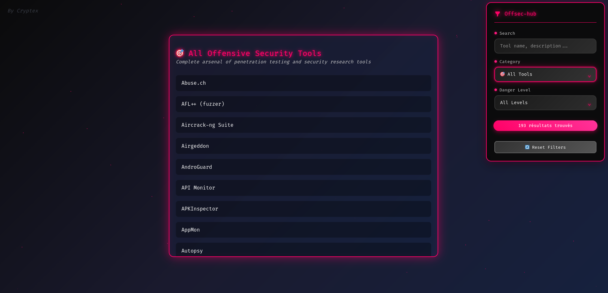

# Offsec Hub
**Offsec Hub** is a curated repository of offensive cybersecurity tools and resources for penetration testing, red teaming, and exploitation. It provide security professionals and enthusiasts with a structured, easy-to-navigate collection of resources.

---

## Table of Contents
- [Features](#features)
- [Installation](#installation)
- [Usage](#usage)
- [Tools & Categories](#tools--categories)
- [Contributing](#contributing)
- [License](#license)
- [Screenshots](#screenshots)

---

## Features
- Centralized repository for offensive security tools
- Categorized by functionality (network, web, exploitation, post-exploitation, etc.)
- Regularly updated with the latest frameworks and scripts
- Easy navigation and search for specific tools or techniques
- Includes references, tutorials, and resources for learning

---

## Installation

1. Clone the repository:  
```bash
git clone https://github.com/thepinguin073/offsec-hub.git
cd offsec-hub
```

2. Open the HTML page:
```bash
# Option 1: Direct browser opening
firefox index.html
# or
google-chrome index.html

# Option 2: Local server (recommended)
python3 -m http.server 8000
# Then open http://localhost:8000/index.html in your browser
```

3. No additional dependencies required - pure HTML/CSS/JavaScript implementation.

---

## Usage

### Filtering Tools
The Offsec Hub interface provides multiple filtering options:

- **Name Filter**: Search tools by name using the search bar
- **Category Filter**: Filter by tool categories (Network, Web, Exploitation, etc.)
- **Danger Level Filter**: Filter by risk level

### Navigation
- Browse tools by categories in the main interface
- Use the filter combinations to find specific tools quickly
- Access external links and documentation directly from tool descriptions

### Best Practices
- Always ensure proper authorization before using any security tools
- Test in isolated environments or authorized penetration testing scenarios
- Follow responsible disclosure practices
- Keep tools updated and verify integrity before use

---

## Tools & Categories

### Network Security
- Port scanners and network discovery tools
- Network vulnerability assessment frameworks
- Traffic analysis and packet manipulation tools

### Web Application Security
- Web vulnerability scanners
- SQL injection and XSS testing tools
- Web application fuzzing frameworks

### Exploitation Frameworks
- Metasploit modules and custom exploits
- Payload generators and encoders
- Buffer overflow and memory corruption tools

### Post-Exploitation
- Privilege escalation tools
- Persistence mechanisms
- Data exfiltration utilities

### Social Engineering
- Phishing frameworks
- Social engineering toolkits
- OSINT gathering tools

### Wireless Security
- WiFi security assessment tools
- Bluetooth and RF analysis utilities
- Wireless attack frameworks

### And much more ...
---

## Contributing

We welcome contributions from the cybersecurity community! Here's how you can help:

Note: The current implementation stores tools directly in the HTML file.

### Contribution Guidelines
- Verify tool functionality before submission
- Ensure all tools are legitimate security research tools
- Provide accurate danger level assessments
- Include proper attribution and licensing information
- Test HTML interface changes before submitting

### Reporting Issues
- Use GitHub Issues to report bugs or suggest improvements
- Provide detailed descriptions and reproduction steps
- Include browser and system information for UI issues

---

## License

This project is licensed under the Apache License 2.0 - see the LICENSE file for details.

### Disclaimer
This repository is intended for educational and authorized security testing purposes only. Users are solely responsible for ensuring they have proper authorization before using any tools listed here. The maintainers are not responsible for any misuse of the tools or resources provided.

### Legal Notice
- All tools should only be used in authorized environments
- Respect applicable laws and regulations in your jurisdiction
- Obtain explicit permission before testing on systems you don't own
- Follow responsible disclosure practices for any vulnerabilities discovered

---

## Screenshots

### Main Interface

*The main Offsec Hub interface showing categorized tools and filtering options*
---

*Last updated: September 2025*

**Remember**: With great power comes great responsibility. Use these tools ethically and legally.
